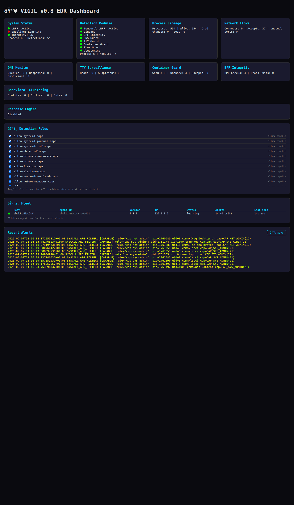

# VIGIL — eBPF Endpoint Detection and Response

## Dashboard



## v0.8.0 — Fleet Mode, Email Routing, ARM64

- **🛰️ Multi-host fleet mode** — one binary, two roles. Agents report status + alerts (gzip'd JSON, shared fleet token, 15-30s cadence) to a central collector; the dashboard's **Fleet tab** shows every agent's health, version, and recent alerts. `fleet.collector_enabled = true` on the collector, `fleet.collector_url` on each agent.
- **✉️ Email/SMTP alert routing** — alerts by mail alongside webhook/Slack/Discord/Telegram/JSONL. STARTTLS (587, default) or implicit TLS (465), per-route minimum level. Use app passwords.
- **📱 ARM64 support** — Raspberry Pi 5, ARM servers, AWS Graviton. `make arm64` cross-compiles the userspace binary (pure Go); `make bpf` on the ARM64 host builds the objects (vmlinux.h auto-regenerates). Syscall wrapper symbols (`__x64_sys_*` / `__arm64_sys_*`) resolve per-architecture everywhere.
- **Dashboard auth** — token-gated API with `?token=` first-visit bootstrap (stored in localStorage), version exposed in `/api/status`.

Also fixed: `alert.Level` JSON decoding, a startup panic when modules are disabled, and `data_dir`/`log_path` config fields (were hardcoded).

## v0.6.0 — Alert Routing, Prometheus Metrics, Rules UI

- **Alert routing** — fan alerts to webhook, Slack, Discord, or Telegram with per-route severity levels, plus a Suricata-style JSONL event log for SIEM ingestion. Non-blocking: destinations can never stall detection.
- **Prometheus `/metrics`** — alert counters, module status, and detection gauges in standard text format. Point Grafana at your VIGIL instance, zero glue.
- **Rules API + UI** — list and toggle syscall-arg rules at runtime via `GET/POST /api/rules`; disable-states persist across restarts (`/etc/vigil/rule_overrides.json`).
- **Multi-callback alert bus** — the response engine and routing run as independent listeners; add your own via `SetCallback`.


*"The watchful eye that never sleeps"*

VIGIL is an eBPF-native Endpoint Detection and Response system for Linux. It protects against endpoint-level adversaries — rootkits, privilege escalation, process injection, and kernel compromise.

## Why VIGIL Exists

Existing EDRs (CrowdStrike, SentinelOne, Defender) run on Windows, cost $15K+/year, and can be repurposed as offensive tools ([EvilEDR, USENIX Security 2025](https://www.usenix.org/conference/usenixsecurity25)). They're blind to:

- **eBPF rootkits** (TripleCross, BPFDoor, VoidLink)
- **ftrace rootkits** (Singularity, Caraxes — kernel 6.x compatible)
- **io_uring evasion** (RingReaper — most EDRs don't monitor io_uring)
- **kernel 6.9+ syscall dispatch patching** (FlipSwitch)
- **LD_PRELOAD rootkits** (Symbiote, SZLIG)
- **Temporal anomalies** from rootkit hooks (measurable time shifts in kernel functions)

VIGIL detects all of these using eBPF probes in the kernel, running at <1% CPU overhead.

## Architecture

```
┌─────────────────────────────────────────────────────┐
│                    Userspace                         │
│                                                      │
│  ┌──────────────┐  ┌──────────────┐  ┌───────────┐ │
│  │  Baseline     │  │  Statistical │  │  Alert    │ │
│  │  Engine       │  │  Detector    │  │  Manager  │ │
│  │  (KS test,   │  │  (sliding    │  │  (console,│ │
│  │   Welch's t)  │  │   windows)   │  │   log)    │ │
│  └──────┬───────┘  └──────┬───────┘  └─────┬─────┘ │
│         │                 │                 │        │
│  ┌──────┴─────────────────┴─────────────────┘      │
│  │              Ringbuf Reader                       │
│  └──────────────────┬──────────────────────────────┘ │
└─────────────────────┼─────────────────────────────────┘
                      │ BPF_RINGBUF (bounded 4MB, TCA-safe)
┌─────────────────────┼─────────────────────────────────┐
│               Kernel (eBPF)                          │
│                                                      │
│  ┌──────────────────┴──────────────────────────────┐ │
│  │  kprobe/kretprobe pairs (6 functions):          │ │
│  │  • do_sys_openat2    (file opens)               │ │
│  │  • vfs_read          (file reads)               │ │
│  │  • __x64_sys_getdents64 (directory listings)    │ │
│  │  • security_inode_permission (permissions)      │ │
│  │  • security_file_permission (file access)       │ │
│  │  • __x64_sys_openat  (syscall-level opens)      │ │
│  │                                                  │ │
│  │  Per-function rate limiting (1000 evt/sec)      │ │
│  │  Per-CPU entry timestamps                       │ │
│  └──────────────────────────────────────────────────┘ │
└──────────────────────────────────────────────────────┘
```

## Detection Method: Temporal Anomaly Detection

Based on [Trace of the Times (DTRAP 2025)](https://doi.org/10.1145/3770085):

1. **Learning phase** (10 min default): Collect timing baselines for kernel functions
2. **Detection phase**: Sliding window of recent samples compared against baseline
3. **KS test**: Detects distribution shape changes (one-sided: only right shifts)
4. **Welch's t-test**: Detects mean shifts (one-sided: only slower = rootkit hook)
5. **Consecutive hits**: Both tests must reject H0 for 3+ consecutive windows

Rootkits that hook kernel functions ADD execution time. Even when they hide their own presence, the timing shift is statistically detectable. **F1 score: 98.7%** (DTRAP 2025).

## v0.2 Scope

| Module | Status | Description |
|--------|--------|-------------|
| Temporal Anomaly | ✅ | Kernel function timing + KS/Welch tests |
| Self-Integrity | ✅ | Binary hash + process ancestry + /proc/self verification |
| TOML Config | ✅ | Full config file support with sensible defaults |
| Baseline Refresh | ✅ | Periodic re-collection to prevent drift |
| Syscall Arg Filter | 🔜 | Context-aware argument inspection (eBPF-PATROL) |
| Cross-View Integrity | 🔜 | Userspace vs kernel view comparison |
| Process Lineage | 🔜 | Parent-child process relationship monitoring |
| the companion proxy Integrity | 🔜 | Watch the companion proxy's process for tampering |

### v0.2 Verification Results

- **Rootkit detection**: 500μs delay on vfs_read → KS D=1.0 (p<0.01) + Welch t=3.49 (p<0.005) → CRITICAL alert
- **False positives**: ZERO over 35 seconds clean operation (6 detection cycles)
- **Self-integrity**: Binary hash, parent process, /proc/self/exe, /proc/self/maps all verified
- **Baseline values (post-outlier-filtering)**: vfs_read=9,749ns, security_file_permission=2,605ns, security_inode_permission=1,471ns

## Building

```bash
# Prerequisites: Go 1.24+, clang 18+, bpftool, kernel with BTF support

./scripts/install.sh
# or: make bpf && make build
```

### ARM64 Support (v0.8.0)

VIGIL runs on ARM64 — Raspberry Pi 5, ARM servers, AWS Graviton:

```bash
# On the ARM64 host — eBPF objects must be compiled against the target
# kernel's BTF (vmlinux.h is auto-regenerated for ARM64 when needed):
make bpf && make build

# Or cross-compile just the userspace binary from an x86 dev box
# (pure Go, no cgo), then build the BPF objects on the ARM64 host:
make arm64
```

Architecture handling is automatic on both sides:
- **Go**: syscall wrapper symbols resolve at runtime — `__x64_sys_*` on amd64, `__arm64_sys_*` on arm64 (`internal/ebpf/arch.go`, used by every kprobe attach site)
- **C**: the same decision at compile time via `-D__TARGET_ARCH_arm64|x86` (`VIGIL_SYSCALL_*` macros in `bpf_src/`); `make bpf`/`install.sh` pass the right flag from `uname -m`
- **PT_REGS register access** follows the target define through `bpf_tracing.h`
- The shipped `vmlinux.h` was generated from an x86 kernel; on ARM64 hosts it is detected (via `user_pt_regs`) and regenerated from the local kernel's BTF

## Running

```bash
# Start VIGIL
sudo systemctl start vigil

# Watch logs
sudo journalctl -u vigil -f

# First run: 10-minute learning phase, then automatic detection
# Baseline saved to /var/lib/vigil/baseline.json
# Alerts logged to /var/log/vigil/alerts.log
```

## Key Design Decisions

### TCA Defense (Telemetry Complexity Attacks)
Per [arXiv 2025](https://arxiv.org/abs/2511.04472), EDR telemetry pipelines are vulnerable to event flooding. VIGIL mitigates:
- **Bounded ringbuf**: 4MB total (1MB per CPU)
- **Per-function rate limiting**: 1000 events/sec max
- **Bounded window storage**: 10,000 samples max per function
- **Backpressure**: events dropped gracefully when pipeline saturated

### eBPF Verifier Defense
Per [SOSP 2025](https://github.com/rs3lab/veritas), the eBPF verifier accepts unsafe programs. VIGIL mitigates:
- **Specification-based verification**: each probe has documented expected behavior
- **Userspace validation**: timing events validated against physical bounds
- **Self-integrity checking**: VIGIL verifies its own binary hashes (SHA256), process ancestry, /proc/self/exe, and /proc/self/maps (rwx injection detection)

### EvilEDR Defense
Per [USENIX Security 2025](https://www.usenix.org/conference/usenixsecurity25), EDRs can be repurposed as offensive tools. VIGIL mitigates:
- **No remote API**: VIGIL runs entirely locally, no cloud dependency
- **Bounded telemetry**: cannot be used for surveillance (BPFflow principle)
- **Process ancestry validation**: VIGIL checks its own init chain (systemd/init expected)

## Integration with the companion proxy

VIGIL shares infrastructure with the companion proxy:
- **Compatible eBPF**: VIGIL's kprobes coexist with the companion proxy's sockops/TC/XDP programs
- **Mutual protection**: VIGIL monitors the companion proxy's integrity, the companion proxy provides network defense
- **Shared BPF maps**: VIGIL can reference the companion proxy's profile_config_map and connection_map
- **Anti-forensic synergy**: the companion proxy wipes traces, VIGIL detects if someone else is tracing

## Academic Foundation

17 papers studied before writing a single line of code. Full references in [STUDY.md](./STUDY.md).

| Paper | Key Contribution |
|-------|------------------|
| eBPF-Shield (SOCA 2026) | Hybrid kernel/userspace architecture, <1% CPU |
| eBPF-PATROL (arXiv 2025) | Syscall argument filtering, 4-component architecture |
| Trace of the Times (DTRAP 2025) | Temporal anomaly detection, 98.7% F1 |
| CryptoGuard (ASIACCS 2025) | Two-phase CNN+LSTM detection, eBPF remediation |
| EvilEDR (USENIX 2025) | EDR repurposing threat — VIGIL must verify integrity |
| TCA (arXiv 2025) | Telemetry flooding — VIGIL must bound its pipeline |
| BPFflow (eBPF '25) | IFC for BPF maps — VIGIL must label telemetry data |
| O2C (arXiv 2024) | ML-in-eBPF — future VIGIL classification in kernel |

## License

**Dual-licensed:**

- **MIT** — all userspace code (Go backend, dashboard, configs). See [LICENSE](LICENSE).
- **GPL v2** — the kernel eBPF programs (`internal/ebpf/bpf_src/*.c`). This is *required by the Linux kernel*: the BPF helpers VIGIL uses are marked GPL-only, and the kernel refuses to load non-GPL-licensed programs that call them. Every eBPF tool ships with this split (Falco, Tracee, Tetragon).

---

*"Study first, research only academic sources" — BIBLE rule #2*

*"Never assume, always check" — BIBLE rule #1*